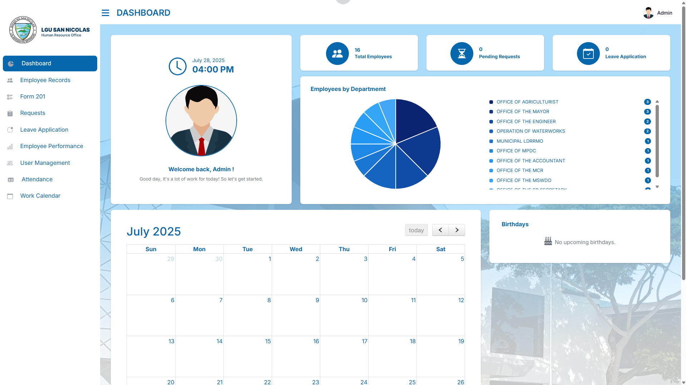
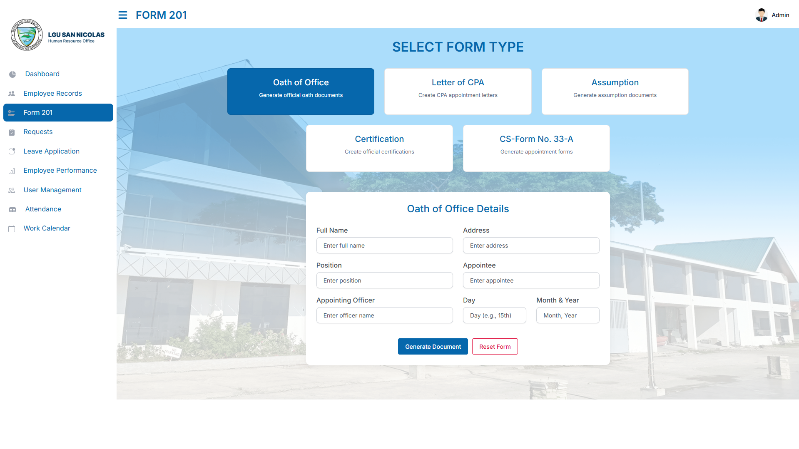
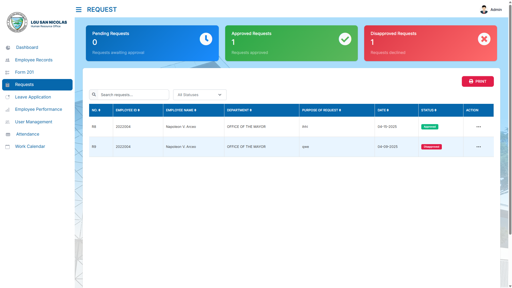
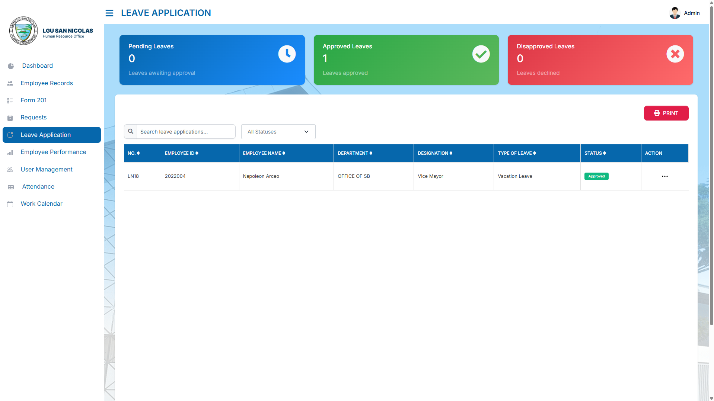
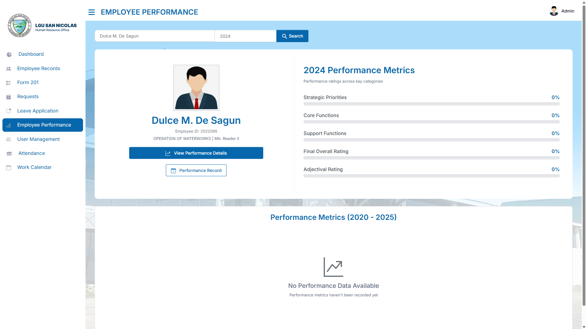
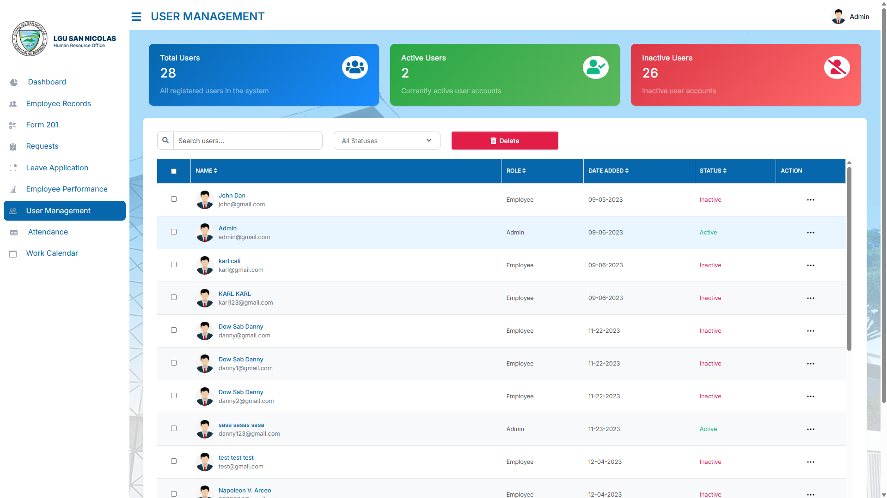
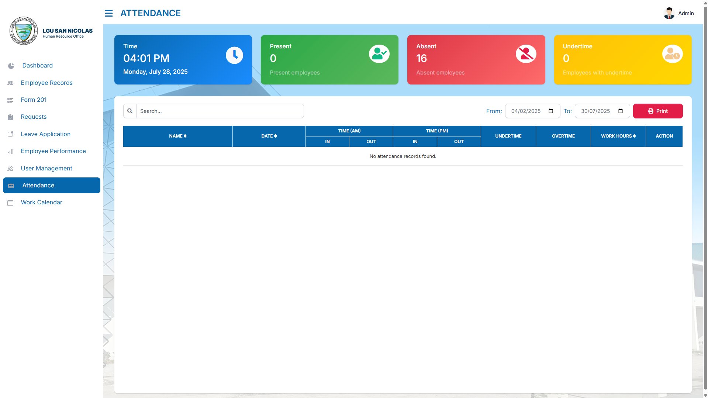

# 💻 Human Resource Information System
The HRIS website helps organizations manage various HR functions.

---

## 📍 Navigation
- **Dashboard**

- **Form 201**

- **Request**

- **Leave Application**

- **Employee Performance**

- **User Management**

- **Attendance**

---

## 🛠️ Technologies Used
- **IDE**: Visual Studio Code
- **Server**: Xampp
- **Database**: phpMyAdmin
- **Language**: HTML, CSS, Javascript, PHP
